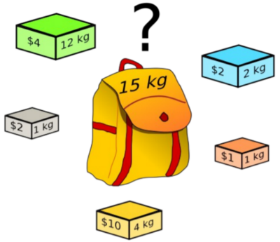

# Problema da Mochila em Python

Para mostrar uma implementação de um Algoritmo Genético, iremos trabalhar com o Problema da Mochila.

Sobre o problema da mochila:

- Problema de otimização combinatória (NP-Completo)
- Estudado por mais de um século (desde ~1897)
- Resolvido por vários algoritmos

Podemos representar a aptidão de uma solução como a soma dos valores dos objetos e com uma penalidade para soluções que passam do limite de volume.

- Queremos o maior valor possível sem ultrapassar o limite da mochila.
- Vários itens que gostaria de levar em uma mochila
- Cada item tem um peso e um benefício, ou valor
- Existe uma capacidade limite de peso
- Deve-se carregar itens com o máximo valor total sem superar o limite de peso

## Execução

python2.9 mochila.py config.json > out.txt

o arquivo out.txt irá conter o resultado da execução, com a melhor solução encontrada

## Problema no Algoritmo

Quando começa a adicionar muitos ítens possiveis de serem colocados na mochila com baixa capacidade o algoritmo pode se perder às vezes.

O problema realmente é na lógica da função de seleção implementado (roleta). O que acontece é que em alguns casos, quando colocamos muitos produtos para serem avaliados, pela aleatoriedade, o algoritmo pode deixar todos os indivíduos, ou a maioria, com pesos maiores do permitido, então todo mundo é penalizado e o algoritmo começa a achar que quanto maior o valor total, melhor.

Se rodar o algoritmo outra vez, pode ser que dê certo, é a coisa da aleatoriedade. É preciso que uma certa quantidade de indivíduos na população inicial tenham pesos a baixo do permitido para poderem seguir em frente.

Nesse caso, pode ser mais interessante o algoritmo de roleta que implementei no [programa genético em Java](https://saulo.arisa.com.br/wiki/index.php/Gen%C3%A9ticos:_Exemplo_em_Java). Nele eu considero o valor ideal o melhor. O que tem a mais ou a menos perde pontos. Bem, existem outros métodos também que dá pra testar.

Caso encontrem outro bug ou quiserem sugerir outro algoritmo de seleção, mandem um [e-mail](mailto:saulopz@gmail.com) pra mim.
